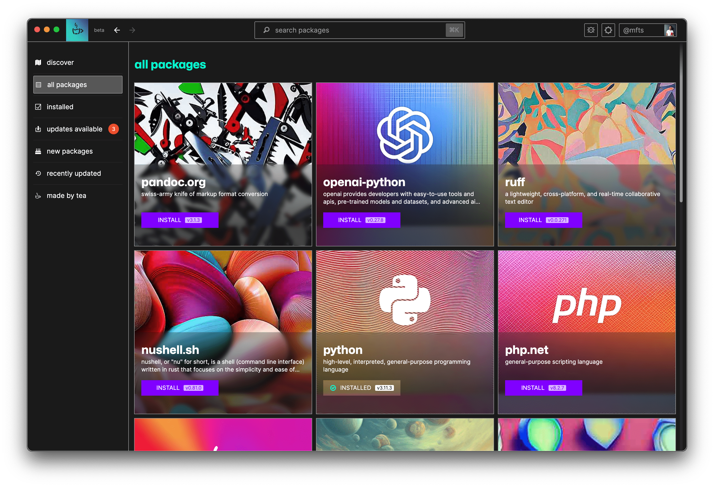

# `tea/gui`

Introducing the `tea/gui` — a visual package manager that lets you browse, install, and update open-source software in a snap. Say goodbye to manual updates and hello to streamlined development.

## Download `tea/gui`

Download the latest version of `tea/gui` [here](https://tea.xyz/gui).

## Open Source

Of course, `tea/gui` is open-source and available on GitHub. We love new contributions. If you have a feature that `tea/gui` should include, please feel free to contribute. You can find the source code on [GitHub](https://github.com/teaxyz/gui).
